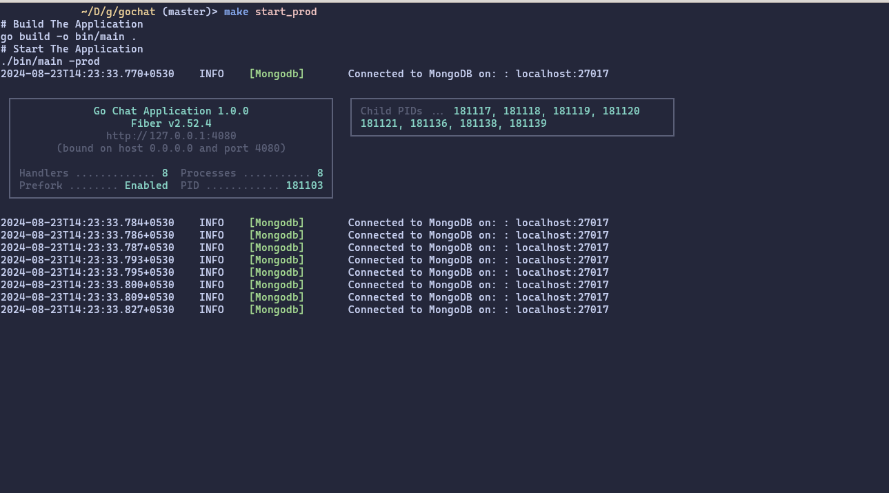
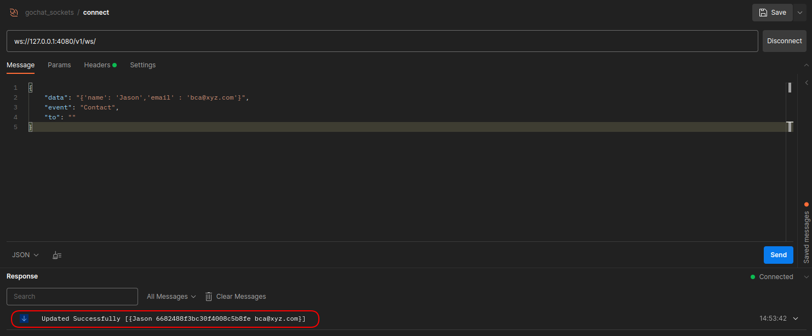
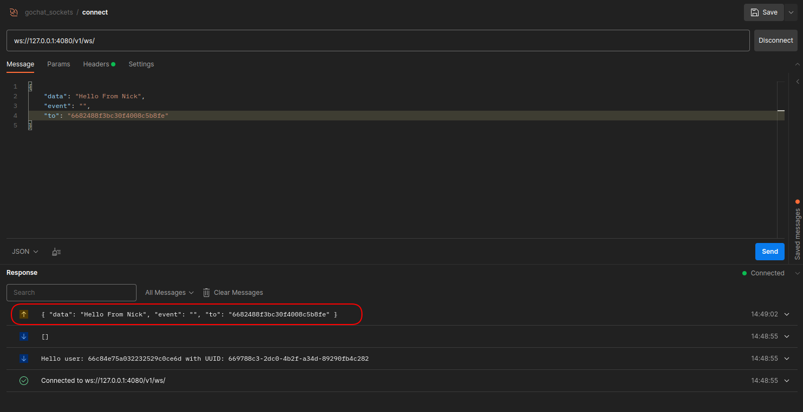
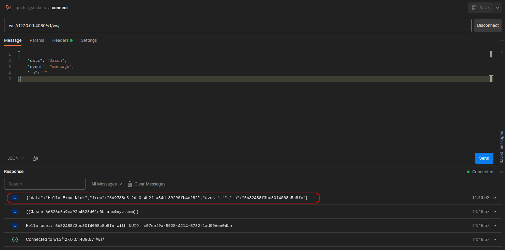

# Go-Chat

> A WebSocket chat application written in Golang
## Technologies Used

- **Language:** Golang
- **Framework:** GoFiber
- **Database**: MongoDB 
- **Logging:** Implemented proper logging mechanisms to track events and errors
- **Rate-Limiting:** Applied rate-limiting on public routes to prevent abuse and ensure stability

## Getting Started

To start the application in production mode, simply run:

```bash
make start_prod
```


## REST API for User Authentication

### Register Users

Use the following API to register new users:


### Login

To authenticate a user, use the login API:


### JWT Authentication

Upon successful login, a JWT token will be returned in the `token` field. This token should be included in the headers of subsequent requests with the `Authorization` key:


## WebSocket Communication

### Message Format

The server accepts messages in JSON format with the following structure:

```json
{ 	
	"data": "",
	"event": "",
	"to": ""
}
```

### Adding Contacts

To add other users to your contact list, use `"Contact"` as the event and specify the contact details in the `data` field. For example:

```json
{ 	
	"data": "{'name': 'Jason', 'email': 'abc@xyz.com'}",
	"event": "Contact",
	"to": ""
}
```



Upon connecting to the WebSocket, you will receive an array of your contacts.

### Sending Messages

To send a message to another user connected to the server, you need to know the user's `userId`, which you can obtain from your saved contacts. Place your message in the `data` field, specify the recipient's `userId` in the `to` field, and leave the `event` field empty.


